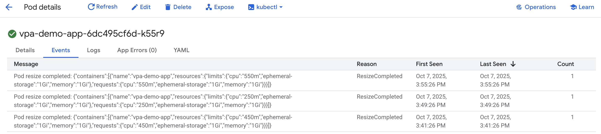
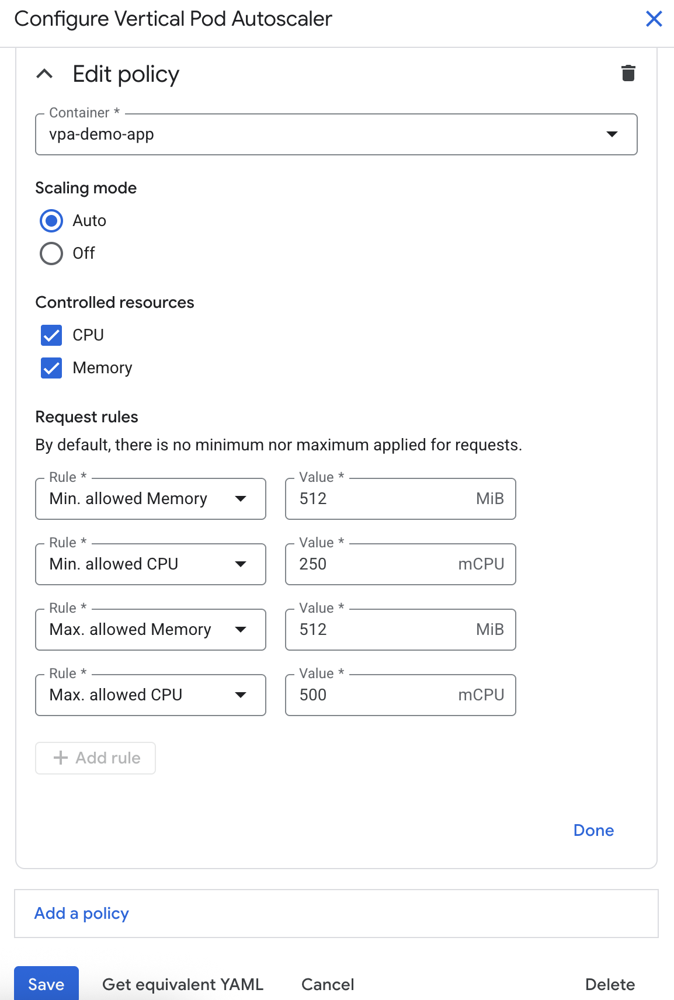
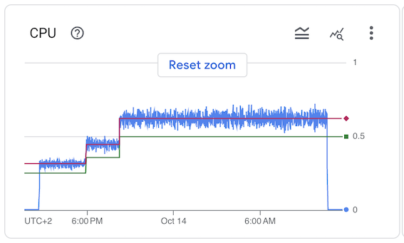

# Introducing no-to-low disruptive VPA in GKE
With the [VerticalPodAutoscaler InPlaceOrRecreate (VPA IPPR) mode (Public Preview)](https://cloud.google.com/kubernetes-engine/docs/concepts/verticalpodautoscaler), now you can benefit from no-to-low disruptive vertical auto scaling on all GKE clusters starting from GKE 1.34.0-gke.2201000 on Rapid Channel.

# Automated Workload Rightsizing with GKE VPA IPPR

In this demo, we will use VPA as automated workload rightsizing. We will create the following:

* `vpa-demo-app` Deployment
* `vpa-demo-service` Service
* `vpa-demo` VerticalPodAutoscaler with the new `InPlaceOrRecreate` mode

A reminder:
Vertical Pod Autoscaler (VPA) frees users from the necessity of setting up-to-date **resource requests** for the containers in their pods. When configured, it will set the requests automatically based on usage and thus allow proper scheduling onto nodes so that appropriate resource amount is available for each pod. It will also maintain ratios between requests and limits that were specified in initial containers configuration.

# Setting up VPA on GKE Standard Cluster

Firstly, let's create GKE Standard Cluster on Rapid Channel with enabled VPA:
```
gcloud container clusters create stnd-rapid-vpa-demo \
    --location=us-east1 \
    --project=<you-project-ID> \
    --enable-vertical-pod-autoscaling \
    --release-channel=rapid
```

As you may notice, with [GKE managed VPA](https://cloud.google.com/kubernetes-engine/docs/concepts/verticalpodautoscaler) you get the VerticalPodAutoscaler capabilities with no-to-minimum cluster-level configurations.

### New VPA InPlaceOrRecreate mode

Now let's go through the new VPA's `InPlaceOrRecreate` mode that automatically rightsizes workloads often without recreating the pod, ensuring seamless service continuity while minimizing costs during idle periods

Firstly, lets deploy all the manifests:
```
kubectl apply -f manifests
```

VPA with `InPlaceOrRecreate` mode looks like this (/manifests/vpa.yaml):
```
apiVersion: autoscaling.k8s.io/v1
kind: VerticalPodAutoscaler
metadata:
  name: vpa-demo
spec:
  targetRef:
    apiVersion: "apps/v1"
    kind:       Deployment
    name:       vpa-demo-app
  updatePolicy:
    updateMode: "InPlaceOrRecreate"  # Use explicit mode instead of deprecated "Auto"
```

After some time from deploying the vpa-demo-app workload, check VPA configuration:
```
kubectl get vpa
```

This is what you should see:
```
NAME       MODE                CPU   MEM       PROVIDED   AGE
vpa-demo   InPlaceOrRecreate   1m    2097152   True       8m45s
```
Once you see "PROVIDED" as `True` like in the above example, it means VPA is up and running for the workload.

### VPA in-place resizing with ContainerResourcePolicy

Now, let's check VPA's recommendations about container-level CPU and Mem resources:
```
kubectl describe vpa vpa-demo
```

Have you noticed `Message: Some containers have a small number of samples` and `Type: LowConfidence`? It means VPA does not have enough data sample to make a relevant recommendation, as we deployed VPA for a new workload (no historic data available). 

To set resources on a level required to maintain reliability of the workload, we will apply VPA's `ContainerResourcePolicy` ([details](https://cloud.google.com/kubernetes-engine/docs/concepts/verticalpodautoscaler#containerresourcepolicy_v1_autoscalingk8sio)): 
```
kubectl apply -f vpa-resource-policy.yaml
```

The `vpa-resource-policy.yaml` looks like this:
```
apiVersion: autoscaling.k8s.io/v1
kind: VerticalPodAutoscaler
metadata:
  name: vpa-demo
spec:
  targetRef:
    apiVersion: "apps/v1"
    kind:       Deployment
    name:       vpa-demo-app
  updatePolicy:
    updateMode: "InPlaceOrRecreate"  # Use explicit mode instead of deprecated "Auto"
  resourcePolicy:
    containerPolicies:
      - containerName: 'vpa-demo-app'
        controlledResources: ["cpu", "memory"]
        mode: Auto
        minAllowed:
          cpu: 250m
          memory: 512Mi
        maxAllowed:
          cpu: 500m
          memory: 512Mi
```

Noticed Mem has the same values for minAllowed and maxAllowed? This way, we want to keep workloads stable by preventing from applying Mem related actuations just yet. Once we collect more data, we can change those settings.

Once applied `ContainerResourcePolicy`, you will notice that VPA resizes pod's resource requests in-place to CPU 250m, value being our minimum CPU to maintain workload's reliability. You can check in-place scaling events created by applying `ContainerResourcePolicy` `minAllowed` in "Pod details" page , Events tab:


Now, let's check VPA Recommendations about container-level CPU and Mem resource requests (`kubectl describe vpa vpa-demo`):
```
Name:         vpa-demo
Namespace:    default
Labels:       <none>
Annotations:  <none>
API Version:  autoscaling.k8s.io/v1
Kind:         VerticalPodAutoscaler
Metadata:
  Creation Timestamp:  2025-10-10T15:07:55Z
  Generation:          2
  Resource Version:    1760109523046239015
  UID:                 a7e18602-1ff6-433b-aa36-eaf7f8874915
Spec:
  Resource Policy:
    Container Policies:
      Container Name:  vpa-demo-app
      Controlled Resources:
        cpu
        memory
      Max Allowed:
        Cpu:     500m
        Memory:  512Mi
      Min Allowed:
        Cpu:     250m
        Memory:  512Mi
      Mode:      Auto
  Target Ref:
    API Version:  apps/v1
    Kind:         Deployment
    Name:         vpa-demo-app
  Update Policy:
    Update Mode:  InPlaceOrRecreate
Status:
  Conditions:
    Last Transition Time:  2025-10-10T15:13:43Z
    Status:                False
    Type:                  LowConfidence
    Last Transition Time:  2025-10-10T15:09:43Z
    Status:                True
    Type:                  RecommendationProvided
  Recommendation:
    Container Recommendations:
      Container Name:  vpa-demo-app
      Lower Bound:
        Cpu:     250m
        Memory:  512Mi
      Target:
        Cpu:     250m
        Memory:  512Mi
      Uncapped Target:
        Cpu:     1m
        Memory:  2097152
      Upper Bound:
        Cpu:     250m
        Memory:  512Mi
Events:
```

After 1-2 weeks of gathering resource utilization data by VPA, we can revisit `ContainerResourcePolicy` configuration and update it accordingly.

# Importance of ContainerResourcePolicy

As a safety net for VPA's actuations of container's resources, it is highly recommended to apply `ContainerResourcePolicy`.

You can modify it directly in vpa object (as demonstrated above) or via Console UI:


# Automated rightsizing based on traffic

Now, let's generate some load for **20 hours** using [hey](https://github.com/rakyll/hey) app: </br>
`kubectl run -i --tty --rm hey --image us-docker.pkg.dev/gke-demos-345619/hey/hey --restart=Never --  -c 2 -z 1200m  http://vpa-demo-service`

Once VPA collected some data, it started to apply recommendations within `ContainerResourcePolicy` boundries to match resources with the load:


VPA actuated resources without restarting the pods (`kubectl get pods`):
```
NAME                            READY   STATUS      RESTARTS   AGE
hey                             0/1     Completed   0          45h
vpa-demo-app-6f79bd954f-qnbtn   1/1     Running     0          4d19h
vpa-demo-app-6f79bd954f-wzdxn   1/1     Running     0          4d18h
```

# Addressing eviction
To be continued...

# Summary

With the new `InPlaceOrRecreate` mode in [GKE managed VPA](https://cloud.google.com/kubernetes-engine/docs/concepts/verticalpodautoscaler), you can benefit from no-to-low disruptive vertical auto scaling for automated workload rightsizing:
1. Apply VPA `InPlaceOrRecreate` mode for a workload with minAllowed and maxAllowed values defined in `ContainerResourcePolicy` ([mind GKE Autopilot's min and ratio resource contrains](https://cloud.google.com/kubernetes-engine/docs/concepts/autopilot-resource-requests)) - VPA gathers resource usage data while keeping minimum resources required for reliable workload operation.
2. Once you gather more resource utilization data, update the `ContainerResourcePolicy` accordingly - let VPA actuate the resources in-place within minAllowed and maxAllowed boundries, so that you can focus on other aspects while improving workload's resource utilization is managed automatically by the VPA IPPR.

# Questions? Ideas for improvements?

If you have questions or improvement ideas for the [k8s' VerticalPodAutoscaler](https://github.com/kubernetes/autoscaler/tree/master/vertical-pod-autoscaler), you can initiate discussion using [SIG Autoscaling Group communication channels](https://github.com/kubernetes/community/tree/master/sig-autoscaling).
