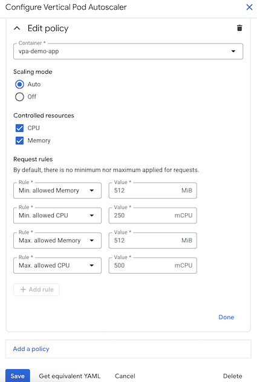

# Introducing no-to-low disruptive VPA in GKE
With the [VerticalPodAutoscaler InPlaceOrRecreate (VPA IPPR) mode (Public Preview)](https://cloud.google.com/kubernetes-engine/docs/concepts/verticalpodautoscaler), now you can benefit from no-to-low disruptive vertical auto scaling on all GKE clusters starting from GKE 1.34.0-gke.2201000 on Rapid Channel.

# Automated Workload Rightsizing with GKE VPA IPPR

In this demo, we will use VPA as automated workload rightsizing. We will create the following:

* `vpa-demo-app` Deployment
* `vpa-demo-service` Service
* `vpa-demo` VerticalPodAutoscaler with the new `InPlaceOrRecreate` mode

A reminder: </br>
Vertical Pod Autoscaler (VPA) frees users from the necessity of setting up-to-date **resource requests** for the containers in their pods. When configured, it will set the requests automatically based on usage and thus allow proper scheduling onto nodes so that appropriate resource amount is available for each pod. It will also **maintain ratios between requests and limits** that were specified in initial containers configuration. ([Source](https://github.com/kubernetes/autoscaler/blob/master/vertical-pod-autoscaler/README.md))

# Setting up VPA on GKE Standard Cluster

Firstly, let's create GKE Standard Cluster on Rapid Channel with enabled VPA:
```
gcloud container clusters create stnd-rapid-vpa-demo \
    --location=us-east1 \
    --project=<you-project-ID> \
    --enable-vertical-pod-autoscaling \
    --release-channel=rapid
```

As you may notice, with [GKE managed VPA](https://cloud.google.com/kubernetes-engine/docs/concepts/verticalpodautoscaler) you get the VerticalPodAutoscaler capabilities with no-to-minimum cluster-level configurations.

### New VPA InPlaceOrRecreate mode

Now let's go through the new VPA's `InPlaceOrRecreate` mode that automatically rightsizes workloads often without recreating the pod, ensuring seamless service continuity while minimizing costs during idle periods

Firstly, lets deploy all the manifests:
```
kubectl apply -f ./basics/
```

VPA with `InPlaceOrRecreate` mode looks like this (/basics/vpa.yaml):
```
apiVersion: autoscaling.k8s.io/v1
kind: VerticalPodAutoscaler
metadata:
  name: vpa-demo
spec:
  targetRef:
    apiVersion: "apps/v1"
    kind:       Deployment
    name:       vpa-demo-app
  updatePolicy:
    updateMode: "InPlaceOrRecreate"  # Use explicit mode instead of deprecated "Auto"
```

After some time from deploying the vpa-demo-app workload, check VPA configuration:
```
kubectl get vpa
```

This is what you should see:
```
NAME       MODE                CPU   MEM       PROVIDED   AGE
vpa-demo   InPlaceOrRecreate   1m    2097152   True       8m45s
```
Once you see `PROVIDED` as `True` like in the above example, it means VPA is up and running for the workload.

### VPA in-place resizing with ContainerResourcePolicy

Now, let's check VPA's recommendations about container-level CPU and Mem resources:
```
kubectl describe vpa vpa-demo
```

Have you noticed `Message: Some containers have a small number of samples` and `Type: LowConfidence`? It means VPA does not have enough data sample to make a relevant recommendation, as we deployed VPA for a new workload (no historic usage data available). 

To set resources on a level required to maintain reliability of the workload, we will apply VPA's `ContainerResourcePolicy` ([details](https://cloud.google.com/kubernetes-engine/docs/concepts/verticalpodautoscaler#containerresourcepolicy_v1_autoscalingk8sio)): 
```
kubectl apply -f ./container-resource-policy/vpa-resource-policy.yaml
```

The `vpa-resource-policy.yaml` looks like this:
```
apiVersion: autoscaling.k8s.io/v1
kind: VerticalPodAutoscaler
metadata:
  name: vpa-demo
spec:
  targetRef:
    apiVersion: "apps/v1"
    kind:       Deployment
    name:       vpa-demo-app
  updatePolicy:
    updateMode: "InPlaceOrRecreate"  # Use explicit mode instead of deprecated "Auto"
  resourcePolicy:
    containerPolicies:
      - containerName: 'vpa-demo-app'
        controlledResources: ["cpu", "memory"]
        mode: Auto
        minAllowed:
          cpu: 200m
          memory: 200Mi
        maxAllowed:
          memory: 300Mi
```

Once applied `ContainerResourcePolicy`, you will notice that VPA resizes pod's resource requests in-place to 250m CPU and 256Mi Mem, value being our minimum CPU to maintain workload's reliability. You can check in-place scaling events created by applying `ContainerResourcePolicy` `minAllowed` in "Pod details" page , Events tab:


Now, let's check VPA Recommendations about container-level CPU and Mem resource requests (`kubectl describe vpa vpa-demo`):
```
Name:         vpa-demo
Namespace:    default
Labels:       <none>
Annotations:  <none>
API Version:  autoscaling.k8s.io/v1
Kind:         VerticalPodAutoscaler
Metadata:
  Creation Timestamp:  2025-10-10T15:07:55Z
  Generation:          2
  Resource Version:    1760109523046239015
  UID:                 a7e18602-1ff6-433b-aa36-eaf7f8874915
Spec:
  Resource Policy:
    Container Policies:
      Container Name:  vpa-demo-app
      Controlled Resources:
        cpu
        memory
      Max Allowed:
        Memory:  300Mi
      Min Allowed:
        Cpu:     200m
        Memory:  200Mi
      Mode:      Auto
  Target Ref:
    API Version:  apps/v1
    Kind:         Deployment
    Name:         vpa-demo-app
  Update Policy:
    Update Mode:  InPlaceOrRecreate
Status:
  Conditions:
    Last Transition Time:  2025-10-10T15:13:43Z
    Status:                False
    Type:                  LowConfidence
    Last Transition Time:  2025-10-10T15:09:43Z
    Status:                True
    Type:                  RecommendationProvided
  Recommendation:
    Container Recommendations:
      Container Name:  vpa-demo-app
      Lower Bound:
        Cpu:     200m
        Memory:  200Mi
      Target:
        Cpu:     200m
        Memory:  200Mi
      Uncapped Target:
        Cpu:     1m
        Memory:  2097152
      Upper Bound:
        Memory:  300Mi
Events:
```

After 1-2 weeks of gathering resource utilization data by VPA, we can revisit `ContainerResourcePolicy` configuration and update it accordingly.

# Importance of ContainerResourcePolicy

As a safety net for VPA's actuations of container's resource requests, it is highly recommended to apply `ContainerResourcePolicy`.

You can modify it directly in vpa object (as demonstrated above) or via Console UI:


# Automated rightsizing based on traffic

Now, let's generate some load for longer duration using [hey](https://github.com/rakyll/hey) app: </br>
`kubectl run -i --tty --rm hey --image us-docker.pkg.dev/gke-demos-345619/hey/hey --restart=Never --  -c 2 -z 1200m  http://vpa-demo-service`

Once VPA collected some data, it started to apply recommendations within `ContainerResourcePolicy` boundries to match resources with the load:


VPA actuated resources without restarting the pods (`kubectl get pods`):
```
NAME                            READY   STATUS      RESTARTS   AGE
hey                             0/1     Completed   0          45h
vpa-demo-app-6f79bd954f-qnbtn   1/1     Running     0          4d19h
vpa-demo-app-6f79bd954f-wzdxn   1/1     Running     0          4d18h
```

# Addressing potential disruptions
To compare how the new `InPlaceOrRecreate` mode is less disruptive, you can deploy workloads with VPA in `Recreate` Mode, the mode that recreates Pods to apply VPA's recommendations:
```
kubectl apply -f ./pdb-handling/
```

Now, let's modify `ContainerResourcePolicy` `minAllowed CPU` few times to "force" actuation.

Meanwhile, observe the PDB for the deployment:
```
kubectl describe pdb vpa-demo-pdb
Name:             vpa-demo-pdb
Namespace:        default
Max unavailable:  0
Selector:         run=vpa-demo-pdb
Status:
    Allowed disruptions:  0
    Current:              2
    Desired:              2
    Total:                2
Events:                   <none>
```

In some point, PDB will block applying the actuation. 

Now, switch the VPA (vpa-recreate.yaml) to `InPlaceOrRecreate` mode. You will notice that actuations initated by `ContainerResourcePolicy` blocked by PDBs will be applied in-place few seconds after changing the mode from `Recreate` to `InPlaceOrRecreate`.

As you noticed, with VPA `InPlaceOrRecreate` mode you don't have to be concerned on pod's recreaton in your business critical hours. Nonetheless, follow best practices and set some safety net with PodDisruptionBudget (PDB). Learn more about [workload disruption readiness on GKE](https://docs.cloud.google.com/kubernetes-engine/docs/how-to/workload-disruption-readiness).

# OOM handling
Imagine you have a workload that is automatically rightsized using in-place pod resizing technology, but sometimes the workload needs to absorb more data. With below example, you decrease the number of on-going disruptions and at the same time handle the OOM events. In case of OOMs, container is restarted and VPA adds 20% to Mem resources.

Below deployment has 2 `replicas` for high availibility of the workload:
```
apiVersion: apps/v1
kind: Deployment
metadata:
 name: vpa-demo-oom-ippr
spec:
 selector:
   matchLabels:
     run: vpa-demo-oom-ippr
 replicas: 2
 template:
   metadata:
     labels:
       run: vpa-demo-oom-ippr
   spec:
     containers:
     - name: vpa-demo-oom-ippr
       args: ["--oom"] # the --oom argument will cause OOMs, comment this argument to "turn-off" OOMs
       image: us-docker.pkg.dev/gke-demos-345619/gke-demos/go-memtest:latest
       imagePullPolicy: Always
       resources:
          requests:
            cpu: 500m
            ephemeral-storage: 2Gi
            memory: 500Mi
          limits:
            ephemeral-storage: 2Gi
            memory: 500Mi
       ports:
       - containerPort: 8080
```
The deployment uses go-memtest app to simulate OOMs ([source](https://github.com/gke-demos/go-memtest)).

Reminder: VPA uses `minReplicas` configuration to decide if it can evict a pod to apply the recommendation: "the minimum number of replicas which need to be alive to attempt Pod eviction (pending other checks like Pod Disruption Budget)" ([GKE VPA docs](https://docs.cloud.google.com/kubernetes-engine/docs/concepts/verticalpodautoscaler#podupdatepolicy_v1_autoscalingk8sio)).

Here is VPA `InPlaceOrRecreate` mode with `minReplicas: 1`:
```
apiVersion: autoscaling.k8s.io/v1
kind: VerticalPodAutoscaler
metadata:
  name: vpa-oom-ippr
spec:
  targetRef:
    apiVersion: "apps/v1"
    kind:       Deployment
    name:       vpa-demo-oom-ippr
  updatePolicy:
    updateMode: "InPlaceOrRecreate"  # Use explicit mode instead of deprecated "Auto"
    minReplicas: 1 # Define it for single Pod workloads
  resourcePolicy:
    containerPolicies:
      - containerName: 'vpa-demo-oom-ippr'
        controlledResources: ["cpu", "memory"]
        mode: Auto
        minAllowed:
          cpu: 100m
          memory: 100Mi
```

Now, let's deploy it all together:
```
kubectl apply -f ./oom-handling/
```

You will observe that the workload is restarted and VPA bumps-up Mem resources every few minutes as the go-memtest app keeps repeating the OOM event.

Learn more about [Troubleshooting OOM events in GKE](https://docs.cloud.google.com/kubernetes-engine/docs/troubleshooting/oom-events).

# Forcing container restart for Mem adjustments

If you have a workload that requires container restart during Mem adjustment, you can specify that aspect in container's `resizePolicy`:
```
apiVersion: apps/v1
kind: Deployment
metadata:
 name: vpa-demo-restartpolicy
spec:
 selector:
   matchLabels:
     run: vpa-demo-restartpolicy
 replicas: 2
 template:
   metadata:
     labels:
       run: vpa-demo-restartpolicy
   spec:
     containers:
     - name: vpa-demo-restartpolicy
       image: us-docker.pkg.dev/gke-demos-345619/gke-demos/hpa-demo:latest
       resizePolicy:
       - resourceName: cpu
         restartPolicy: NotRequired # Default, but explicit here
       - resourceName: memory
         restartPolicy: RestartContainer
       resources:
          requests:
            cpu: 100m
            ephemeral-storage: 1Gi
            memory: 200Mi
          limits:
            ephemeral-storage: 1Gi
            memory: 300Mi
       ports:
       - containerPort: 8080
```

Now, change CPU minAllowed in `ContainerResourcePolicy` - you will observe CPU's in-place scale-up without any disruption. Now, change the minAllowed Mem - the container will be restarted togher with Mem's in-place scale-up (less disruptive - without Pod recreation).

Noticed that other examples do not specify container's `resizePolicy`? If you do not specify the resizePolicy, the default would be `NotRequired`. Learn more about container level resizePolicy [here](https://kubernetes.io/docs/tasks/configure-pod-container/resize-container-resources/). 

Also, mind that you have container-level [resizePolicy](https://kubernetes.io/docs/tasks/configure-pod-container/resize-container-resources/) and seperately container-level [restartRules](https://kubernetes.io/docs/concepts/workloads/pods/pod-lifecycle/#container-restart-rules), both for different purpose.

# Summary

With the new `InPlaceOrRecreate` mode in [GKE managed VPA](https://cloud.google.com/kubernetes-engine/docs/concepts/verticalpodautoscaler), you can benefit from no-to-low disruptive vertical auto scaling for automated workload rightsizing:
1. For each new workload, apply VPA in advisory mode (`Off` Mode) - this way VPA gathers resource usage data and fine-tune the recommendations based on the usage pattern.
2. After gathering some usage data, apply VPA `InPlaceOrRecreate` mode for a workload with minAllowed values defined in `ContainerResourcePolicy` ([mind GKE Autopilot's min and ratio resource contrains](https://cloud.google.com/kubernetes-engine/docs/concepts/autopilot-resource-requests)). With minAllowed, VPA keeps minimum resources required for reliable workload operation.
3. Once you gather more resource utilization data, update the `ContainerResourcePolicy` accordingly - let VPA actuate the resources in-place within minAllowed and maxAllowed boundries, so that you can focus on other aspects while improving workload's resource utilization is managed automatically by the VPA IPPR.

Alternativly, apply VPA with `InPlaceOrRecreate` mode from very beginning.

# Questions? Ideas for improvements?

If you have questions or improvement ideas for the [k8s' VerticalPodAutoscaler](https://github.com/kubernetes/autoscaler/tree/master/vertical-pod-autoscaler), you can initiate discussion using [SIG Autoscaling Group communication channels](https://github.com/kubernetes/community/tree/master/sig-autoscaling).
